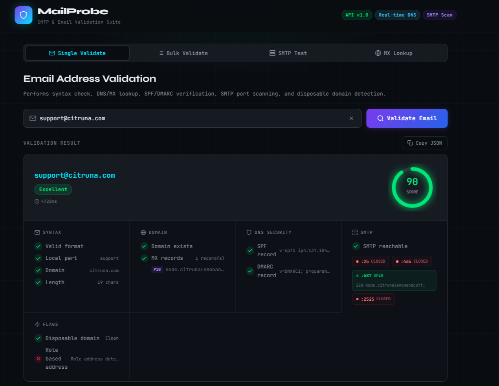
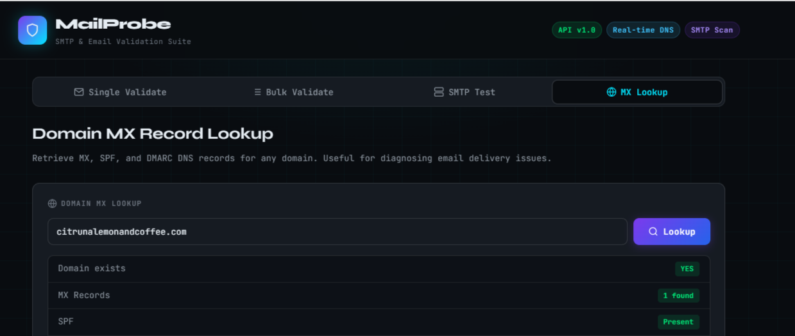

# MailProbe — SMTP Checker & Email Validation Suite

A full-stack SMTP and email validation tool built with **React.js** (frontend) and **Node.js + Express.js** (backend).

---

## Features

### Email Validation
- **Syntax check** — RFC-5321 compliant regex
- **DNS lookup** — Confirms domain existence
- **MX record detection** — Lists all mail exchange servers with priority
- **SPF record check** — Sender Policy Framework detection
- **DMARC record check** — Domain-based Message Authentication detection
- **SMTP port scan** — Tests ports 25, 465, 587, 2525
- **Disposable domain detection** — 50+ known disposable providers flagged
- **Role-based address detection** — admin, info, noreply, etc.
- **Typo suggestions** — Detects common domain typos (gmial.com → gmail.com)
- **Deliverability score** — 0–100 weighted score with label

### Bulk Validation (up to 20 emails)
- Processes all emails with DNS + MX checks
- Summary stats: valid count, disposable count, MX presence, invalid count

### SMTP Connection Tester
- Direct TCP connection to any host:port
- Captures SMTP server banner

### MX Domain Lookup
- Lookup MX, SPF, DMARC records for any domain

---

## Project Structure

```
smtp-checker/
├── backend/
│   ├── server.js        # Express API
│   └── package.json
└── frontend/
    ├── public/
    │   └── index.html
    ├── src/
    │   ├── App.js        # React UI
    │   ├── App.css       # Styles
    │   └── index.js
    └── package.json
```

---

## Setup & Running

### Backend

```bash
cd backend
npm install
node server.js
# API running at http://localhost:5000
```

### Frontend

```bash
cd frontend
npm install
npm start
# App running at http://localhost:3000
```

> The frontend proxies API requests to `http://localhost:5000` via the `"proxy"` field in `package.json`.

---

## API Endpoints

| Method | Endpoint | Description |
|--------|----------|-------------|
| `POST` | `/api/validate` | Full email validation |
| `POST` | `/api/validate/bulk` | Bulk validate up to 20 emails |
| `POST` | `/api/smtp/test` | Test SMTP server connectivity |
| `GET` | `/api/mx/:domain` | Lookup MX/SPF/DMARC for domain |
| `GET` | `/api/health` | API health check |

### POST /api/validate

**Request:**
```json
{ "email": "user@example.com" }
```

**Response:**
```json
{
  "email": "user@example.com",
  "score": 92,
  "deliverability": { "label": "Excellent", "color": "green" },
  "checks": {
    "syntax": { "valid": true, "localPart": "user", "domain": "example.com", "length": 16 },
    "domain": { "exists": true, "hasMX": true, "mxRecords": [{ "exchange": "mail.example.com", "priority": 10 }] },
    "dns": { "hasSPF": true, "spfRecord": "v=spf1 ...", "hasDMARC": true, "dmarcRecord": "v=DMARC1 ..." },
    "smtp": { "reachable": true, "portResults": [...] },
    "disposable": false,
    "roleBasedAddress": false,
    "typoSuggestion": null
  },
  "processingTime": 843
}
```

### POST /api/validate/bulk

**Request:**
```json
{ "emails": ["user1@gmail.com", "test@yahoo.com"] }
```

### POST /api/smtp/test

**Request:**
```json
{ "host": "smtp.gmail.com", "port": 587 }
```

### GET /api/mx/gmail.com

---

## Scoring System

| Check | Weight |
|-------|--------|
| Valid syntax | 20 pts |
| Domain exists | 15 pts |
| Has MX record | 25 pts |
| SMTP reachable | 20 pts |
| SPF present | 10 pts |
| DMARC present | 10 pts |
| Disposable domain | −30 pts |
| Role-based address | −10 pts |

| Score | Label |
|-------|-------|
| 85–100 | Excellent |
| 65–84 | Good |
| 45–64 | Fair |
| 25–44 | Poor |
| 0–24 | Invalid |

---

## Rate Limiting

The API applies a rate limit of **100 requests per 15 minutes** per IP address on all `/api/` routes.

---

## Tech Stack

| Layer | Technology |



|-------|-----------|
| Frontend | React 18, CSS3 (no UI library) |
| Backend | Node.js, Express 4 |
| DNS | Node.js built-in `dns.promises` |
| SMTP | Raw TCP via Node.js `net` module |
| Fonts | JetBrains Mono, Syne (Google Fonts) |
